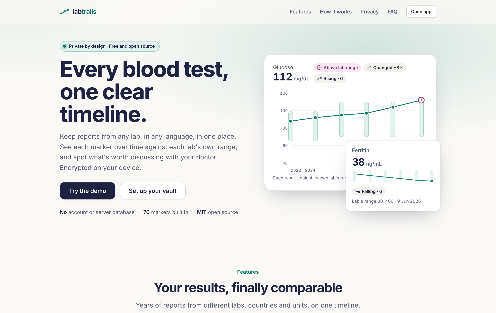
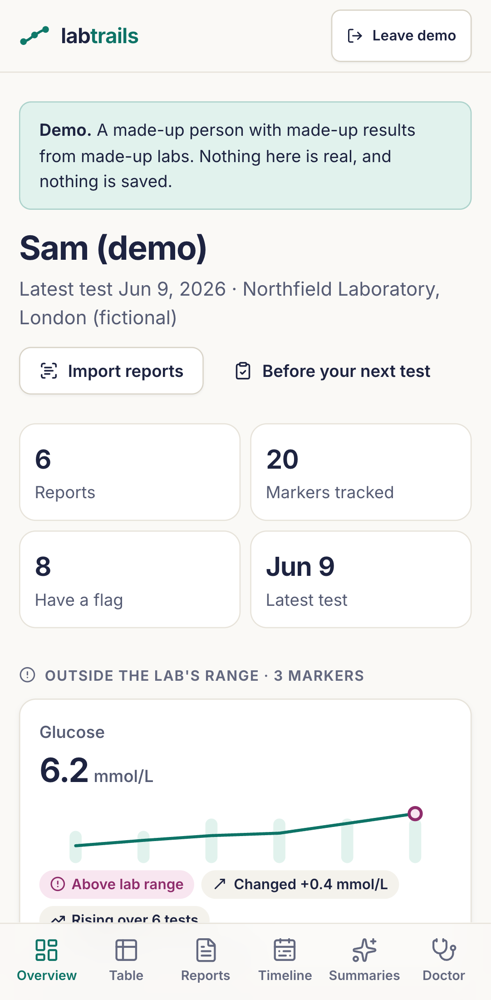
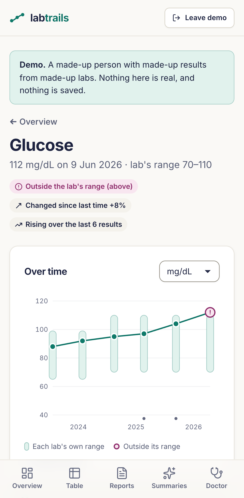
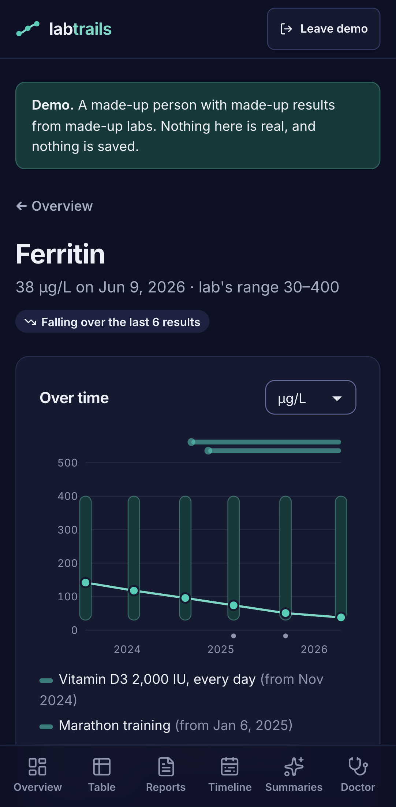
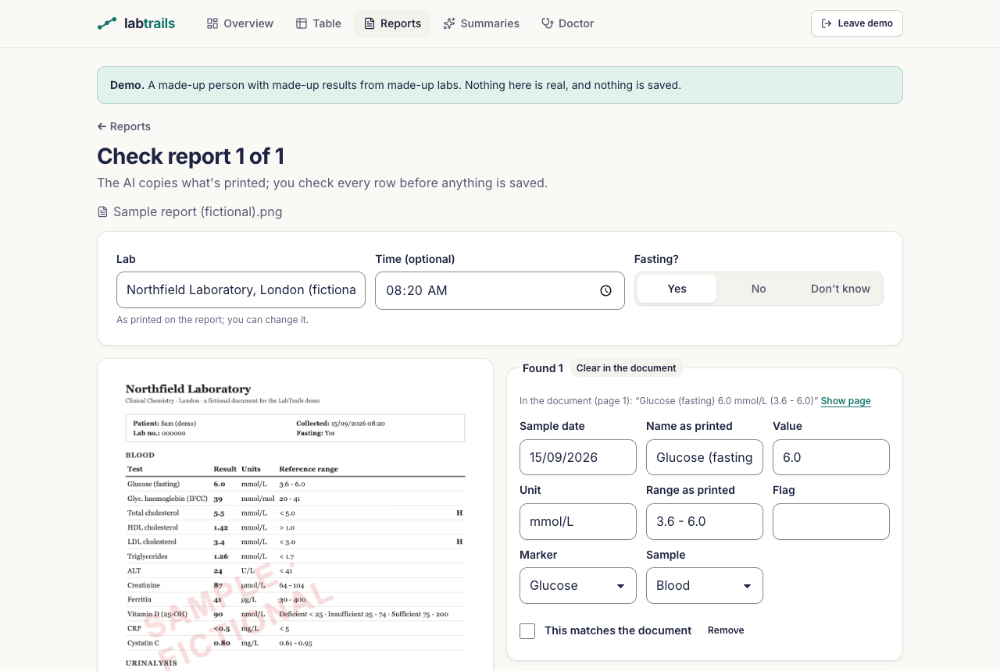

# LabTrails

**Your blood test results, private and in one place.** Keep your lab reports together, see each
marker over time against the lab's own reference range, and spot what's outside the range or has
changed, to discuss with your doctor.

**Free and open source** (MIT licence). No account, no subscription, no ads, no analytics. Your results
are encrypted and stay in your own browser. Website: [labtrails.app](https://labtrails.app) (being set
up).

<p>
  
</p>

<p>
  
  
  
</p>

## What it does

- **All your results in one place,** from any lab and any country. Portuguese and English names
  ("Glicose", "Colesterol HDL", "TGO/AST") are recognised, and about 70 common markers are built in.
  Anything else is kept exactly as printed.
- **Each marker over time.** One chart per marker, in the unit you choose (mg/dL or mmol/L, for
  example). Labs print different reference ranges, so each result is drawn against **its own** lab's
  range, not one "normal" band. A table shows every marker by date.
- **Flags decided by simple, published rules, not by AI:**
  - *Outside the lab's range*: compared with the range printed on that report.
  - *Changed since last time*: a change of at least a quarter of the range's width.
  - *Rising* or *falling*: three or more results moving the same way.

  These are heuristics, not medical thresholds. The app explains them under **How flags work**.
- **Notes on each test:** fasting or not, the time of day, medications and supplements ("same as last
  time" is one tap), recent illness, hard exercise, alcohol or poor sleep. They never change a flag,
  but they show on the chart and help explain a result.
- **Import reports with AI (optional).** Add PDFs or photos, several at once or in a zip. If you
  agree, the AI copies out the results; LabTrails matches them to its catalogue; **you check every row**
  next to the original page before anything is saved. Files you've already imported, rows you already
  have, and a second copy of a report you already saved are all recognised. Files you keep for later
  wait under "Not read yet". A report that also lists earlier results (several sample dates side by
  side) becomes one report per date.
- **Fix one result without starting over.** Correct a value that was misread, add one that was
  missed, delete one, or map a name LabTrails didn't know to a marker. A mapping is remembered for
  the next report and can be applied to every earlier result printed the same way.
- **Summaries with AI (optional):** what changed in a new report, or an overview of everything, with
  questions you could ask your doctor. The AI only explains what LabTrails' rules flagged.
- **A one-page report for your doctor,** printed, saved as PDF or shared as an image. It's a file you
  share yourself, never a link to a server.
- **Several people** in one vault (for example you and your partner). Make sure they're happy for
  their results to be kept here.
- **Works offline** and installs like an app on your phone.

<p>
  
</p>

## Not medical advice

LabTrails records, charts and explains. It never diagnoses, never says you're healthy or ill, and never
suggests treatments, supplements, doses or medication changes. A flag means "worth discussing with your
doctor", nothing more.

## Why it's private

- **Your results never reach our server.** The website only sends the app itself. Everything you type
  or upload is stored **encrypted in your browser**, with a key made from your passphrase.
- **There's no account and no password reset.** "Logging in" means unlocking your vault on this device.
  If you forget the passphrase, nobody, including us, can get your results back. **Keep a backup.**
- **AI is optional and uses your own key.** When you choose an AI feature, your browser sends the
  request straight to Anthropic (the company that makes Claude), using your own Anthropic API key.
  Before anything is sent, LabTrails shows you exactly what goes and asks you to confirm. For summaries,
  your name and date of birth are left out. An uploaded report usually shows your name itself, and
  LabTrails can't remove it from a PDF or photo.
- **What Anthropic does with it:** as of 6 October 2026, Anthropic's
  [Commercial Terms](https://www.anthropic.com/legal/commercial-terms) say it may not train models on
  what you send through the API, and its
  [Privacy Center](https://privacy.claude.com/en/articles/7996866-how-long-do-you-store-my-organization-s-data)
  says API inputs and outputs are deleted within 30 days (longer only if flagged as violating its usage
  policy). The request goes under your own Anthropic account.
- **One device per vault, for now.** There's no sync. To move your results to another device, or to
  keep them safe, download a backup (still encrypted) and restore it there.

For the details and the honest limits (a compromised device, a forgotten passphrase, what Anthropic
sees, a malicious version of the app), read the [threat model](THREAT_MODEL.md).

## Getting started

1. Open [labtrails.app](https://labtrails.app) and choose **Try the demo**: a made-up person with three years of
   results. No passphrase or key needed.
2. To keep your own results, **set up a vault** with a passphrase. Four or more random words work well.
3. **Add a person**, then a report: type the results in as printed, or read a report with AI.
4. **Download a backup** now and then (Settings), and keep it somewhere other than this device.
5. On iPhone, **add LabTrails to your Home Screen** (Share, then "Add to Home Screen"). Safari can delete
   a website's data after 7 days without a visit; Home Screen apps keep theirs
   ([WebKit](https://webkit.org/blog/10218/full-third-party-cookie-blocking-and-more/)).

## What it costs

LabTrails is free. The AI features use your own Anthropic account, billed by Anthropic. Rough estimates
with the default model (Claude Sonnet 5.5, $2 per million input tokens and $10 per million output
tokens, Anthropic's prices on 6 October 2026):

- Reading a three-page report: about **3 to 4 US cents**.
- A summary: about **1 to 2 US cents**.

Use a dedicated API key with a spending limit, set in Anthropic's console. Without a key, everything
except reading reports and writing summaries still works.

## For developers

Vite, React and TypeScript; IndexedDB for the encrypted records; hand-rolled SVG charts; Vitest and
Playwright. Node 22.

```bash
npm ci
npm run dev       # http://localhost:5173
npm test          # unit tests
npm run test:e2e  # browser tests against the production build
```

- [SPEC.md](SPEC.md): what the first version does and why.
- `src/labs/`: the catalogue, unit conversions (every factor cited in `catalogue/sources.ts` and
  tested), parsing, matching and the flag rules. All pure and tested.
- `src/core/` (the encrypted vault, storage, backup, settings, documents, the import flow, the review
  screen, the AI client and the Trails UI kit) is shared with LabTrails' sister app, [BabyTrails](https://github.com/tbutman/babytrails),
  and copied from it with `scripts/sync-core.sh`. The source commit is in `src/core/SOURCE`; currently
  [babytrails@471767d](https://github.com/tbutman/babytrails/commit/471767d).
- Every push and pull request runs lint, typecheck, unit tests, the build and the browser tests. The
  browser tests fail if the app requests anything from any site other than itself (and, in the tests
  that use a mocked AI, Anthropic's API). They also run [axe](https://github.com/dequelabs/axe-core)
  on every screen against WCAG 2.1 AA, in the light and dark themes at phone and desktop widths, check
  that no screen scrolls sideways, and test the skip link and the focus move after each screen change.
- Lighthouse (mobile, median of three runs on the production build): landing page performance 97,
  accessibility 98, best practices 100; first contentful paint 1.8 s, total blocking time 9 ms, no
  layout shift. The landing page loads alone; each app screen is fetched when first opened and kept
  offline by the service worker.
- Found a security problem? See [SECURITY.md](SECURITY.md).

## Licence

Free and open source under the [MIT licence](LICENSE).
