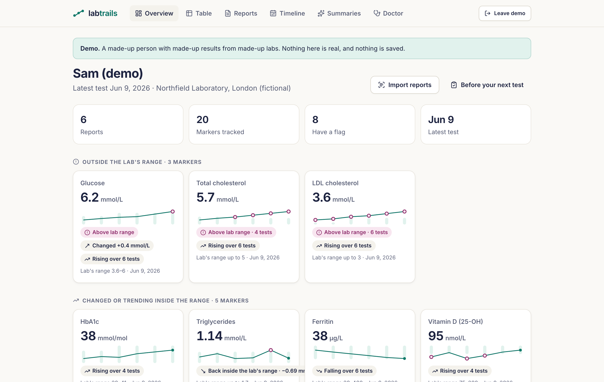
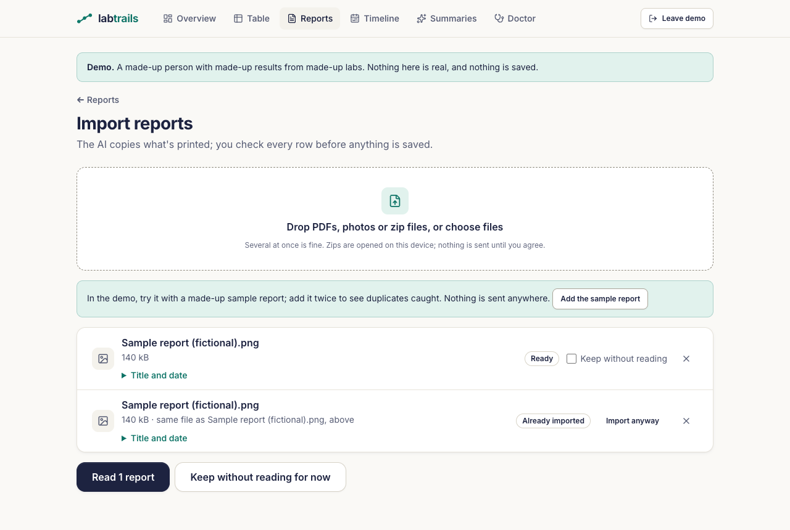
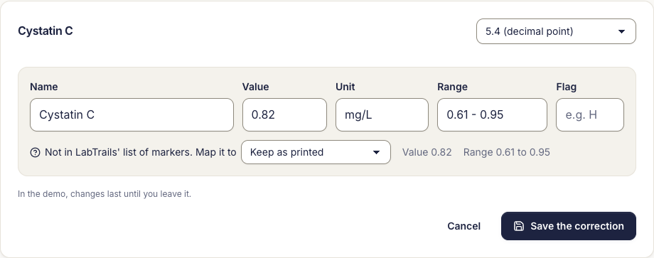
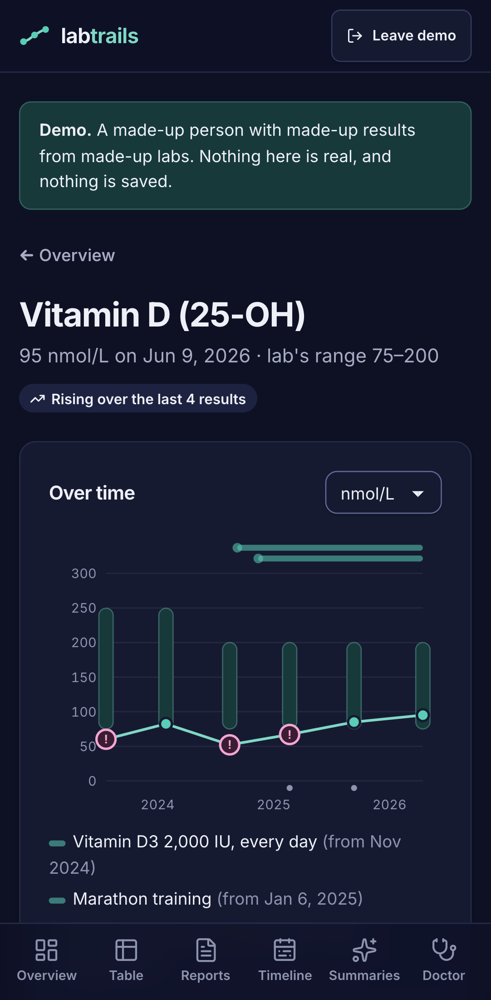

# LabTrails: blood test results over time, private by design

*Case study, October 2026, by [Thomas Butman](https://tbutman.com). LabTrails is live at
[labtrails.app](https://labtrails.app) and in active development. Free and open source (MIT). Code:
[github.com/tbutman/labtrails](https://github.com/tbutman/labtrails). Screenshots show the demo;
every name and value in them is made up.*

  

## The problem

My blood test results lived in a long ChatGPT thread: years of reports from labs in Portugal and the
US, in two languages and two sets of units. Comparing one marker across years meant scrolling and
converting in my head. Most trackers want an account and a copy of your results on their servers,
which is a lot to ask for health data, and many lean on AI to tell you what your results "mean".

I wanted something narrower and more trustworthy: every result in one place, each marker on a chart
over time, clear flags for what's outside the lab's range or has changed, and help preparing for a
conversation with my doctor. Not a diagnosis.

## The decisions that shaped it

**Local-first, bring your own key.** The app is static files. Results are encrypted in the browser
(AES-256-GCM, with the key derived from a passphrase using Argon2id) and never reach my server: no
accounts, no database, no analytics. AI is optional; the browser calls Anthropic directly with the
user's own API key, after a screen that shows exactly what will be sent. The cost of this choice is
real (no password reset, no sync between devices), so the app says so plainly and pushes encrypted
backups.

**The code flags; the AI explains; the user confirms.** This split runs through the whole app:
- **Flags are code.** "Outside the lab's range", "changed since last time" and "rising or falling"
  are pure, tested functions, labeled in the app as heuristics, not clinical thresholds.
- **The AI copies; the code decides.** Reading a report, the AI only copies rows as printed into a
  JSON schema whose marker field is limited to catalog IDs. LabTrails' own matching maps names
  first; the AI's suggestion is a fallback, marked "Unsure".
- **The user confirms every row** next to the original page before anything is saved, so text in a
  document that tries to steer the AI goes nowhere unless the user ticks it.
- **Summaries are grounded** in a facts object the code builds, with the person's name and date of
  birth removed, and prompts that forbid diagnosing, adding flags or suggesting treatment.

**Each result against its own range.** Labs print different reference ranges, so a single "normal"
band would be wrong. Each chart point sits on its own lab's range, and flags compare each result with
that range.

  

**Store what was printed; convert when showing.** Values, units and ranges are kept exactly as printed,
and converted only for display and flags, so a wrong factor could be fixed without touching anyone's
data. Every conversion factor is derived from a molar mass, cross-checked against the AMA's SI table,
cited in the code and tested against an independently computed value. That check caught one wrong
factor (creatinine) before release. A few details mattered more than expected:
- Insulin uses 6.00 pmol/L per µIU/mL; the often-quoted 6.945 comes from a superseded 1959 standard.
- Portuguese "ureia" (urea) and US "BUN" (urea nitrogen) are different measurements, about 2.14×
  apart, so they're separate markers and BUN appears on the urea chart converted and labeled.
- Lp(a) refuses to convert between mg/dL and nmol/L, following the European Atherosclerosis Society's
  advice that no single factor is valid.
- Reports from two countries mean decimal commas and points, "<0,5" and "inferior a", and dates like
  03/04 that could be March or April, which the user confirms.

## Importing years of reports

The first version read one report at a time. Importing a history needed more, so the import became a
queue:

- **Several files or zips at once.** Zips are opened in the browser, with caps on file count and
  unpacked size so a crafted zip can't exhaust memory.
- **Duplicates caught at three levels.** The same file is recognized by its SHA-256 fingerprint before
  anything is sent to the AI (saving the cost of reading it again). The same report from a different
  file, such as a PDF and a photo of it, is recognized by its values, with a "Skip this one" link. And
  rows already saved are left out of the review, so nothing is doubled on the charts.
- **One agreement for the batch,** then each report is stored, read and checked in turn. Anything not
  read yet stays listed, so leaving mid-way loses nothing.
- **Reports that carry their own history.** Many labs print earlier results next to the new ones, in
  columns by date. The AI copies each result once per date with that column's date, the review shows
  the date on every row, and saving makes one report per date. A PDF with four dates fills in four
  points on every chart, and dates already in the vault show up as already saved.

  
  

## Fixing what was misread

Reviewing every row catches most mistakes, but not all. Any saved result can now be corrected on its
own: fix a misread value, add a result the AI missed, delete one, or map a name the catalog didn't
know to a marker. A mapping is remembered, so the next report printed the same way matches by itself,
and it can be applied to every earlier result with that name. The same fields and parser serve manual
entry, so a value reads the same however it got in, and numbers are shown with the report's own
decimal mark.

  

## Two apps, one core, two agents

LabTrails was built alongside a sister app, [BabyTrails](https://babytrails.app) (baby growth on WHO
charts), by two AI coding agents working in parallel, which I directed and reviewed. They share a core:
the encrypted vault, storage, backup, documents, the review screen, the AI client, a design system and
now the import flow. Ownership was explicit: BabyTrails owned the core, and LabTrails wrote some shared
pieces first (the design system and the import), which then moved into the core. The agents
coordinated through a shared notes file of proposals, requests and a log, with me deciding anything
that affected both apps.

**A design system, not a theme.** After the first versions worked, both apps were rebuilt on one kit:
Inter throughout with tabular figures, a shared palette with one accent per app, and components from
form fields to metric cards and landing-page sections. Each app has its own landing page from the same
template. Color contrast is checked against WCAG 2.1 by a unit test in both apps; it caught a teal
that was 4.3:1 on one surface, below the 4.5:1 minimum.

## Accessible and fast

Accessibility is tested, not assumed. In CI, axe checks all 16 screens against WCAG 2.1 AA in the
light and dark themes, at phone and desktop widths, and a separate check fails any screen that scrolls
sideways. That check found a real bug: on a phone, the table of every marker made the whole page 888
pixels wide on a 375-pixel screen, because screen-reader-only labels inside table cells escaped the
scroll container. Keyboard and screen-reader users get a "Skip to content" link, and after each screen
change, focus moves to the new heading and the tab's title names the screen.

The landing page now loads alone: app screens are fetched when first opened (and kept offline by the
service worker), the encryption code loads just after the first render, and the font is preloaded.
Its JavaScript and CSS went from 187 kB to 136 kB compressed. On Lighthouse's simulated mid-range
phone, the landing page scores 97 for performance (from 95), 98 for accessibility and 100 for best
practices, with first text on screen at 1.8 s (from 2.1 s) and no layout shift.

## Tested on real reports

The extraction was run, outside the repository, on four of my own Portuguese reports from two labs.
Every value came back right, but the app's own handling had gaps a fictional demo never shows:
urinalysis rows named like blood tests ("Glicose", "Leucócitos") were matched to blood markers; an
age-banded PSA range ("40 - 49 anos: 0 - 2.5") parsed as 40 to 49 and would have flagged a normal
result; banded vitamin D ranges weren't read; and 81 rows needed a manual check because Portuguese
report names ("V.G.M.", "Creatininémia", "TFGe") weren't in the catalog. After the fixes the same
reports needed no manual checks. Every case is now reproduced in English, with a made-up person and
lab, in fictional PDFs and phone photos that a live extraction check (`npm run test:live`) reads
for real and compares row by row.

## Reading results in context

An AI chat about blood tests gets useful as it goes on because of context: when a medication started,
whether the blood was drawn before or after a dose, what wasn't repeated. LabTrails now keeps that
context and computes from it, without diagnosing:

- **A personal timeline** of medications, supplements, lifestyle changes and events, shown as bands
  on every chart and in the table, and, if the user ticks it, on the doctor report.
- **Dose timing per test** ("drawn 29 days after the last dose"), and a fourth flag for results
  outside the lab's range on several tests in a row.
- **Known influences**: 42 documented pairs (for example, eating before the test can raise glucose
  slightly), each cited to MedlinePlus, the NHS, Lab Tests Online UK or, where none of those says the
  same thing, Testing.com (formerly Lab Tests Online), with the quote checked against the page, and
  matched to the user's own timeline and notes. Each sentence is no stronger than its source ("statins
  can raise glucose in some people"). The app states a documented influence and the user's
  entry, never a cause.
- **Ask about your results**, answered only from the markers the question names, with every number
  in an answer checked against what was sent; with consent, the timeline and influences go too.
  Asked "Why has my vitamin D gone up?", a real model gave the facts, noted the supplement started
  between two tests, and said a timeline entry doesn't show a cause; asked about changing a dose, it
  declined.
- **Personal lines** a user or their doctor sets on a chart, and **"Before your next test"**: what
  was measured last time, what wasn't repeated, and the user's chosen tests written as a request in
  English or Portuguese.

  

## After an outside review

In October 2026 an independent product review of both apps, with a clinical pass, found things the
tests hadn't. The fixes, each now tested:

- **Critical results looked like slightly high ones.** A glucose the lab marked "HH" showed the same
  chip as a TSH just above its range. The lab's critical marks are now their own flag, a simple rule
  flags results at least one range width outside the range, and both show fixed text: check the
  result against the report, then contact your doctor or the lab today.
- **Small values rounded to a different number.** 0.003 showed as "0"; values under 1 now keep three
  significant digits.
- **The doctor report lacked dates.** Each row now has its date, lab and previous result, the lab's
  own marks and conversions, with a header saying what it covers and a hidden table for screen readers.
- **Sources and wording.** Influence sentences said "is known to raise" where the sources say "may, in
  some people"; they now say "can", with the source's own limits. Nine of the 17 pairs that cited
  Testing.com, which now sells the tests it explains, cite Lab Tests Online UK instead.
- **Smaller gaps:** a person can be deleted with everything about them, "6,500" no longer defaults to
  6.5, units LabTrails can't convert are flagged against their own range instead of vanishing, and
  locking or reloading returns you to the same screen. From the shared core: "Erase this vault" for a
  forgotten passphrase, a new passphrase asked twice, and a restore that checks the passphrase before
  replacing anything.

## Shipping and what broke

The apps are served as static files from my home server through a Cloudflare Tunnel, deployed by
pulling checksummed GitHub releases, so no workflow holds server credentials. Going live surfaced real
problems, each now guarded by a test:

- The PDF viewer's worker was served with the wrong type (nginx has no entry for `.mjs`), so PDFs
  wouldn't open. CI now serves every build through the server's own nginx config and checks every
  file's type.
- Returning visitors kept seeing the old version after a deploy, because the new offline worker
  waited for every tab to close. Both apps now show a Reload banner instead, since switching by itself
  would lock the vault and drop anything being typed.
- A shared encryption test failed now and then. It turned out to be a false positive: random encrypted
  bytes, written as base64, occasionally contain the four letters it checked for.
- One deploy left the live app blank. Requesting the new build's script a moment before the server had
  installed it returned a 404, and because nginx sent its one-year cache header even on 404s,
  Cloudflare kept serving that 404 after the file arrived. Missing files are now served "don't cache",
  and CI checks it.
- The same deploy ran 12 minutes late: three apps' timers asking GitHub's API for the latest release
  every two minutes added up to more than its 60 unauthenticated requests an hour. Deploys now read
  the release from GitHub's public redirect instead, and arrive within a minute.

## What was tested

- **421 unit tests**, including every unit conversion both ways, English and Portuguese marker names,
  the flag rules with ranges from different labs, banded and age-banded ranges, the extraction
  validator, summary facts never containing the name or date of birth, zips and zip bombs, duplicate
  detection, cumulative reports split by date, correcting results, the timeline and dose timing, the
  influence table (sources, quotes, and the pairs no source supports kept out), Ask's numbers check
  with lab units, critical marks and the far-outside rule, small values never rounding to 0, the
  doctor report's rows, deleting a person, color contrast, and the shared core's encryption, backup,
  passphrase, erase and review rules.
- **27 browser tests** against the production build, every one failing if the app contacts any site
  other than itself: a full vault round trip that leaves nothing readable in the browser's database,
  the demo, installing and reloading offline, a whole import with all three duplicate levels,
  photos grouped as the pages of one report, correcting single results, the timeline on the chart,
  table and doctor report, dose timing, personal lines across units, axe on every screen in both
  themes at two widths, the keyboard path, and, with a mocked AI, that nothing is sent before the user
  agrees, the person's name never appears in a request, only ticked rows are saved, a three-date
  report becomes three reports, Ask withholds an answer with an unchecked number, and AI text with
  HTML in it is shown as text. Newer ones: a kept PDF opening offline, deleting a person, returning to
  the same screen after a lock or reload, a reloaded demo, a warning before leaving a filled form,
  erasing the vault, and changing the passphrase.
- **A live extraction check** on the fictional reports, run by hand after prompt or matching changes.
- **CI** runs lint, typecheck, the tests, the build and the nginx check (including that missing files
  are never cached) on every push.

## What's next

- Using the whole app with my own history: reports, timeline and questions.
- Per-marker change thresholds based on published biological variation, instead of one percentage for
  every marker.
- Later: more AI providers, encrypted sync between devices, and a Portuguese interface.
