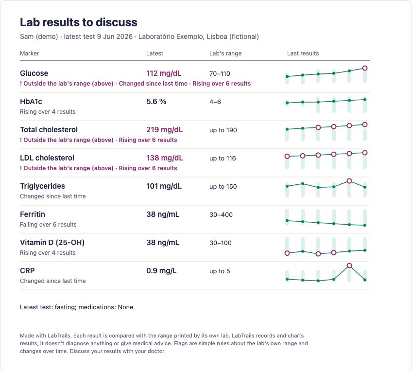

# LabTrails: blood test results over time, private by design

*Case study, October 2026. Screenshots show the demo; every name and value in them is made up.*

## The problem

My blood test results lived in a long ChatGPT thread: years of reports from labs in Portugal and the
US, in two languages and two sets of units. Comparing one marker across years meant scrolling and
converting in my head. Existing trackers mostly want an account and a copy of your results on their
servers, which is a lot to ask for health data, and many lean on AI to say what your results "mean".

I wanted something narrower and more trustworthy: every result in one place, each marker on a chart
over time, clear flags for what's outside the lab's range or has changed, and help preparing for a
conversation with my doctor. Not a diagnosis.

  
  
  

## The design decisions

**Local-first, bring your own key.** The app is static files. Results are encrypted in the browser
(AES-256-GCM, with the key derived from a passphrase using Argon2id) and never reach my server. There
are no accounts, no database and no analytics. AI features are optional: the browser calls Anthropic
directly with the user's own API key, after a screen that shows exactly what will be sent. The cost of
this choice is real: no password reset, and no sync between devices. The app says so plainly and
pushes encrypted backups.

**The code flags; the AI explains; the user confirms.** This split runs through the whole app:

- **Flags are code.** "Outside the lab's range", "changed since last time" (a quarter of the range's
  width) and "rising or falling" (three or more results in one direction) are pure, tested functions.
  The app labels them as heuristics, not clinical thresholds.
- **The AI copies; the code decides.** When reading a report, the AI only copies rows exactly as
  printed into a JSON schema whose marker field is limited to catalogue IDs. LabTrails' own matching
  maps names to the catalogue first; the AI's suggestion is used only as a fallback and marked
  "Unsure". Numbers, ranges and dates are parsed by code.
- **The user confirms every row** next to the original page before anything is saved. A row the AI
  invents, or text in a document that tries to give the AI instructions, goes nowhere unless the user
  ticks it.
- **Summaries are grounded.** They're written from a facts object the code builds: values, each lab's
  range, the computed flags and the test context, with the person's name and date of birth removed. The
  prompts forbid diagnosing, adding flags or suggesting treatment.

  

**Each result against its own range.** Labs use different methods and print different reference
ranges, so a single "normal" band would be wrong. Each chart point sits on its own lab's range, and
flags compare each result with that range. The same value can be inside one lab's range and outside
another's, and the app shows that honestly.

**Store what was printed; convert when showing.** Values, units and ranges are kept exactly as printed.
Conversions (mg/dL to mmol/L and so on) happen only for display and flags, so a wrong factor could be
fixed without touching anyone's data. Some details mattered more than expected:

- Every conversion factor is derived from a molar mass, cross-checked against the AMA's table, cited in
  the code and tested against an independently computed value. The check caught one wrong factor
  (creatinine) before release.
- Insulin uses 6.00 pmol/L per µIU/mL. The often-quoted 6.945 comes from a superseded 1959 standard.
- Portuguese "ureia" (urea) and US "BUN" (urea nitrogen) are different measurements, about 2.14×
  apart. They stay separate markers, and BUN results appear on the urea chart converted and labelled.
- Lp(a) refuses to convert between mg/dL and nmol/L, following the European Atherosclerosis Society's
  advice that no single factor is valid.
- Reports from two countries mean decimal commas and points, "<0,5" and "inferior a", and dates like
  03/04 that could be March or April. Ambiguous dates must be confirmed.

**Accessible and calm.** Flags are plum, not red or amber, and never shown by colour alone: every flag
has an icon, a ring on the chart and words. Contrast was checked against WCAG 2.1 in both themes.

  

## Two apps, one core, two agents

LabTrails was built alongside a sister app, [BabyTrails](https://github.com/tbutman/babytrails) (baby
growth on WHO charts), by two AI coding agents working in parallel, which I directed. BabyTrails owns
the shared core: vault, storage, backup, documents, the review screen and the AI client. LabTrails
copies it at a recorded commit with a script that reads from the commit, not the working tree. The two
agents coordinated through a shared notes file: proposals, requests and a log, with me deciding
anything that affected both apps. The two apps share a visual identity ("Honey and ink") with a
different accent each.

## What was tested

- **259 unit tests**, including:
  - every unit conversion in both directions;
  - matching English and Portuguese marker names;
  - parsing values and ranges as printed in both countries;
  - the flag rules, with results from labs that print different ranges;
  - the extraction validator dropping malformed AI output;
  - summary facts never containing the person's name or date of birth;
  - the demo's flags matching what its pre-written summaries say;
  - AI text with HTML in it always rendered as text.

  The shared core's own tests (encryption, tampering, wrong passphrases, backups, review rules) run
  here too.
- **7 browser tests** against the production build, under its Content-Security-Policy. Every one fails
  if the app requests anything from a site other than itself. They cover:
  - a full vault round trip, checking that nothing readable is left in the browser's database;
  - the demo;
  - installability, and reloading offline;
  - with a mocked Anthropic API: nothing is sent before the user agrees; the person's name never
    appears in a request; only ticked rows are saved; a summary containing HTML shows as text.
- **CI** runs lint, typecheck, unit tests, the build and the browser tests on every push.

## What's next

- Live at labtrails.app, served as static files from my home server through a Cloudflare Tunnel, with
  the same pull-based release deploys as my website.
- Testing with my own reports in my own browser.
- Later: asking questions about your history, more AI providers, encrypted sync between devices, a
  Portuguese interface, and per-marker change thresholds based on published biological variation
  instead of one percentage for every marker.
